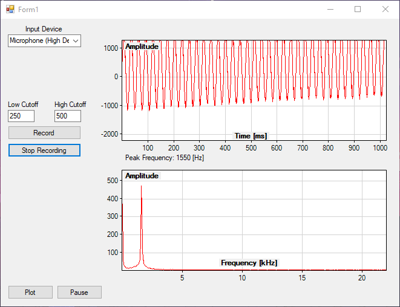

**Realtime Audio Signal Processing**

**Overview**

This application is designed for real-time audio spectrum visualization and bandpass filtering. It utilizes C\# .NET, ScottPlot, NAudio, and SoxSharp libraries to plot amplitude-time and frequency-time graphs, and to record and filter audio.

**Features**

-   **Real-time Audio Spectrum Visualization:** Displays amplitude-time and frequency-time graphs.
-   **Bandpass Filtering:** Applies a low-pass and high-pass filter to the audio input.
-   **Recording and Playback:** Records audio and plays back the filtered audio in real-time.

**Requirements**

-   .NET Framework
-   ScottPlot
-   NAudio
-   SoxSharp
-   Sox (Sound eXchange)

**Setup**

1.  **Install Dependencies:**
    -   Ensure you have the .NET Framework installed.
    -   Install ScottPlot, NAudio, and SoxSharp via NuGet Package Manager.
2.  **Download and Install SoX:**
    -   Download SoX version 14.4.1 from [here](https://sourceforge.net/projects/sox/files/sox/14.4.1/).
    -   Install SoX and note the installation directory.
3.  **Clone the Repository:**
```
    git clone https://github.com/eminemirhansener/Realtime-Audio-Filtering-VS.net.git
```
4.  **Open the Project:**
    -   Open the project in Visual Studio.
5.  **Configure SoX Path:**
    -   Update the path to SoX executable in Form1.cs:
```
        using (var sox = new Sox("C:\\\\Path\\\\To\\\\SoX\\\\sox.exe"))
```
6.  **Build and Run:**
    -   Build the project and run the application.
    -   
**Usage**


**UI Components**

-   **Input Device:** Dropdown to select the audio input device.
-   **Low Cutoff / High Cutoff:** Textboxes to set the low and high cutoff frequencies for the bandpass filter.
-   **Plot Button:** Starts the audio visualization.
-   **Pause Button:** Pauses the audio visualization.
-   **Record Button:** Starts recording and playback of filtered audio.
-   **Stop Recording Button:** Stops recording and playback.

**Visualization**

-   **Amplitude-Time Graph:** Displays the audio signal in the time domain.
-   **Frequency-Time Graph:** Displays the audio signal in the frequency domain.

**Peak Frequency**

-   Displays the peak frequency of the audio signal in real-time.
